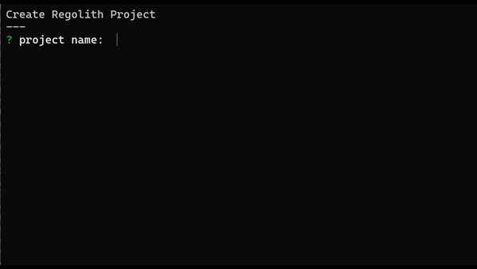

# init-full
Filter that creates bedrock manifest files on install



## How to use
1. Run the regular `regolith init` command

2. Run this command
```
regolith install init-full
```

3. Fill in all the information it asks, it will uninstall itself once finished.
